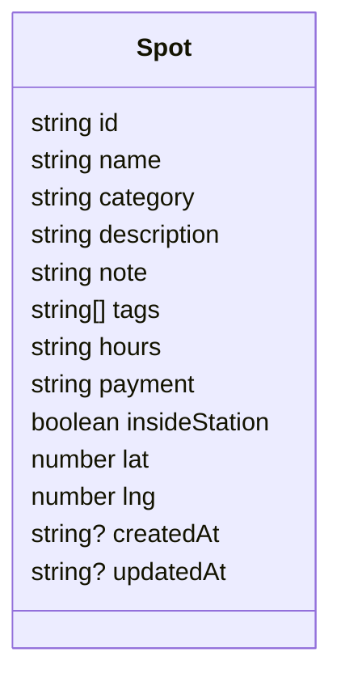

# Data Schema: `Spot`

Mermaid class diagram and JSON Schema for the `Spot` data used in `data/spots.json`.



## JSON Schema

```json
{
  "$schema": "http://json-schema.org/draft-07/schema#",
  "title": "Spot",
  "type": "object",
  "required": ["id","name","category","lat","lng"],
  "properties": {
    "id": { "type": "string" },
    "name": { "type": "string" },
    "category": { "type": "string", "enum": ["Toilet","Coin locker","Trash bin","ATM","Smoking area","Station exit"] },
    "description": { "type": "string" },
    "note": { "type": "string" },
    "tags": { "type": "array", "items": { "type": "string" } },
    "hours": { "type": "string" },
    "payment": { "type": "string" },
    "insideStation": { "type": "boolean" },
    "lat": { "type": "number" },
    "lng": { "type": "number" },
    "createdAt": { "type": "string", "format": "date-time" },
    "updatedAt": { "type": "string", "format": "date-time" }
  }
}
```

**Notes**

- `id` should be unique across spots.
- `category` is restricted to the six MVP categories.
- `lat`/`lng` use WGS84 decimal degrees.
- `createdAt`/`updatedAt` are optional and useful when migrating to a DB-backed system.
